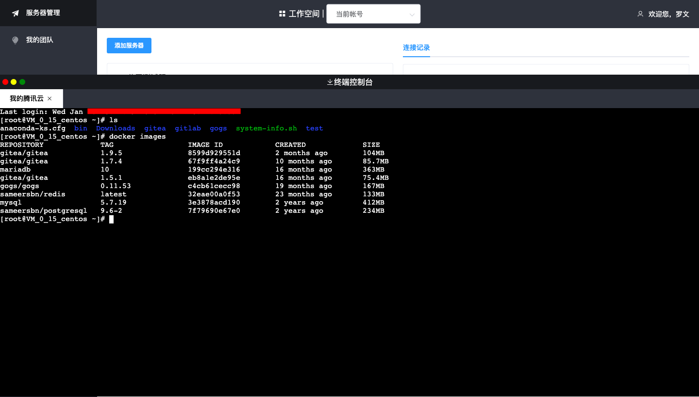
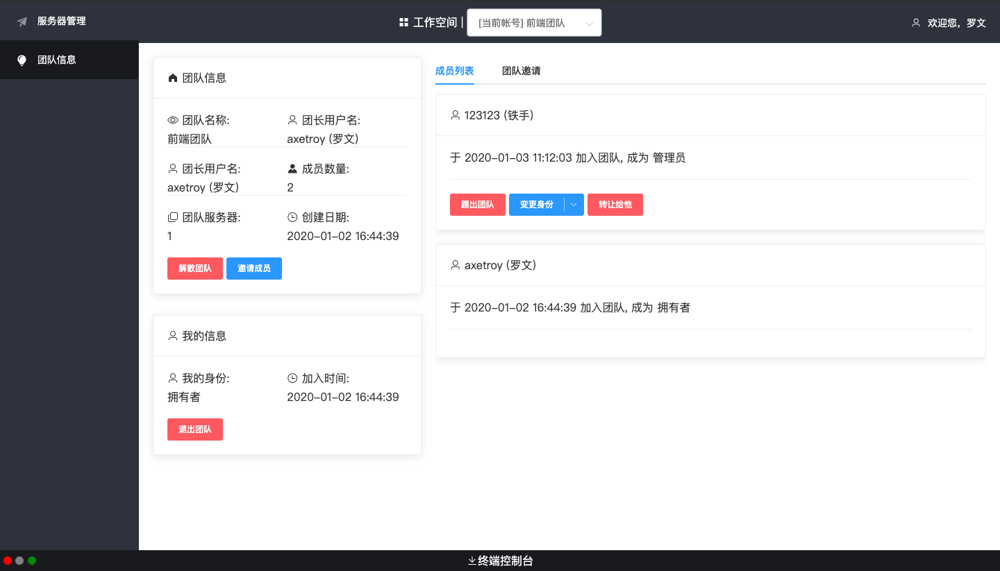

<div align="center">

## Web Server Manager


[](https://github.com/axetroy/wsm/actions)
[](https://hub.docker.com/r/axetroy/wsm-backend/builds)
[](https://coveralls.io/github/axetroy/wsm?branch=master)
[](https://goreportcard.com/report/github.com/axetroy/wsm)


[](https://github.com/axetroy/wsm/actions)
[](https://hub.docker.com/r/axetroy/wsm-frontend/builds)
[](https://deepscan.io/dashboard#view=project&tid=6484&pid=8581&bid=105883)

</div>

<div align="center">
通过 Web 来管理远端服务器

创建团队，邀请你的小伙伴加入，管理你的服务器

成员无需关心服务器的`地址/帐号/密码/密钥`等敏感信息，即可连接服务器进行操作

你在终端的每一步操作，都会被完整地记录下来，并且支持回放功能

> 有内鬼，终止交易

</div>




<h3 align="center">特性</h3>

- [x] 用户无需 密码/私钥 即可连接服务器
- [x] Web 登录终端
- [x] 支持打开多个终端
- [x] 支持团队管理终端，可分配不同的角色到不同的团队
- [x] 操作记录回放，每一次连接终端，都会记录完整的操作，支持回放
- [ ] 分享一次性终端，可以匿名连接，终端断开不能在链接
- [x] 支持 Docker Compose 一键部署

使用技术 Golang + Node.js + Nuxt.js 构建，前后端分离

<h2 align="center">如何使用</h3>

```shell
$ git clone https://github.com/axetroy/wsm.git $GOPATH/src/github.com/axetroy/wsm
$ cd $GOPATH/src/github.com/axetroy/wsm
```

### 启动后端 API

```shell
$ go run cmd/user/main.go start
```

### 启动前端页面

```shell
$ cd ./frontend
$ yarn
$ npm run dev
```

<h2 align="center">部署</h2>

部分部署分为两部分

- 数据库
- 程序

### 数据库

使用 docker-compose 部署数据库

```yaml
version: "3"
services:
  # 数据库
  pg:
    image: postgres:9.6.16-alpine
    restart: always
    volumes:
      - "./volumes/pg:/var/lib/postgresql/data"
    ports:
      - 54321:5432 # 本机端口:容器端口
    environment:
      - POSTGRES_USER=terminal # 用户名
      - POSTGRES_PASSWORD=terminal # 数据库密码
      - POSTGRES_DB=terminal # 数据库名

  # 缓存
  redis:
    image: redis:5.0.7-alpine
    restart: always
    ports:
      - 6379:6379
    volumes:
      - "./volumes/redis:/data"
    environment:
      - REDIS_PASSWORD=password
    command: ["redis-server", "--requirepass", "password"]
```

### 程序

部署应用程序，使用 `Nginx` + `前端镜像` + `后端镜像` 进行部署

需要使用 [nginx.conf](nginx.conf) 文件和 [docker-compose.yml](docker-compose.yml) 文件

```yaml
version: "3"
services:
  # 网关
  nginx:
    image: nginx:1.17.6-alpine
    restart: always
    volumes:
      - ./nginx.conf:/etc/nginx/nginx.conf # 映射 nginx 配置文件
      - ./logs/nginx:/var/log/nginx # 日志文件
    ports:
      - 9000:80 # 本机端口:容器端口
    links:
      - frontend
      - backend

  # 前端
  frontend:
    image: axetroy/wsm-frontend:latest
    restart: always
    environment:
      - PORT=80
      - HOST=0.0.0.0

  # 后端接口
  backend:
    image: axetroy/wsm-backend:latest
    restart: always
    environment:
      - USER_HTTP_PORT=80
      - DB_HOST=192.168.3.15 # 数据库的IP地址
      - DB_PORT=54321 # 数据库的端口
```

<h2 align="center">许可协议</h2>

[Apache License 2.0](LICENSE)
